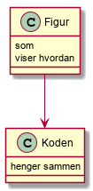

Lasse Og Fredrikk sit filserver prosjekt

Dette prosjektet inneholder en java client og server som som kan lese fra fil og test classer til disse.

## Usage

1. mvn package
2. <-jar http-server-1.0-SNAPSHOT.jar>
3. <http://localhost:8080/index.html>
4. </echo?status=302&location=http://example.com>
5. </echo?body=helloWorld!>
 
 ## Design (valgfritt)
 

 ## Implementation notes
 
<Hva gjorde dere godt i implementasjonen>

Vi jobbet godt sammen under implimentajsonen og kodet godt i parrkoding

<Hva følte dere at dere ikke fikk til i implementasjonen>

Mye av koden var vanskelig og forstå vi brukte derfor lang tid på og rette feil i tester og classer.
Måtte slette Git for og starte på nytt grunnet mye 

